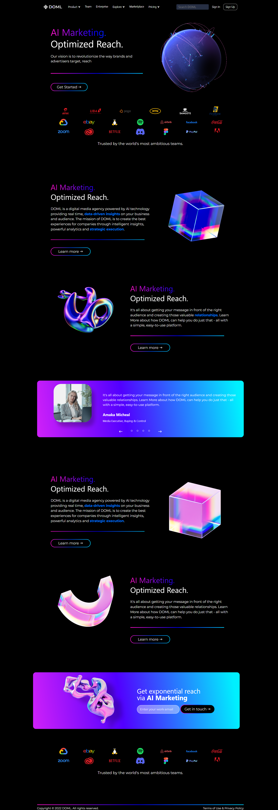

# AI Marketing Website  

A responsive landing page for an AI Marketing platform.  
Built completely from scratch as a learning project to practice HTML, CSS, and JavaScript.  

## 🚀 Demo  
[Live Demo](https://N1nerox.github.io/ai-marketing-website/)  

## ✨ Features  
- Fully responsive design (desktop & mobile)  
- Hamburger menu with dynamic mobile navigation  
- Slider with navigation arrows and dots  
- Semantic HTML structure  
- Clean and simple UI  

## 🖼️ Screenshot  
  

## 🛠️ Technologies  
- HTML5  
- CSS3 (Flexbox, Grid, Media Queries)  
- JavaScript (DOM Manipulation, Event Listeners)  

## 📚 What I Learned  
- How to build a responsive layout with Flexbox and Grid  
- Using media queries for mobile adaptation  
- Creating a hamburger menu with pure JavaScript  
- Implementing a basic slider with JS and CSS transitions  
- Working with GitHub Pages to deploy a project  

---
Made with ❤️ by N1nerox
